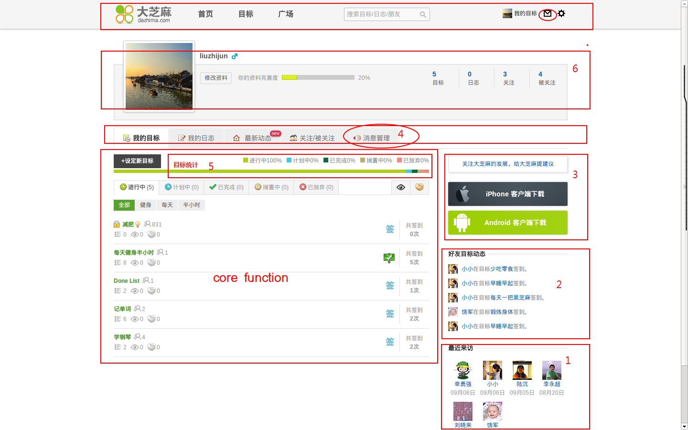
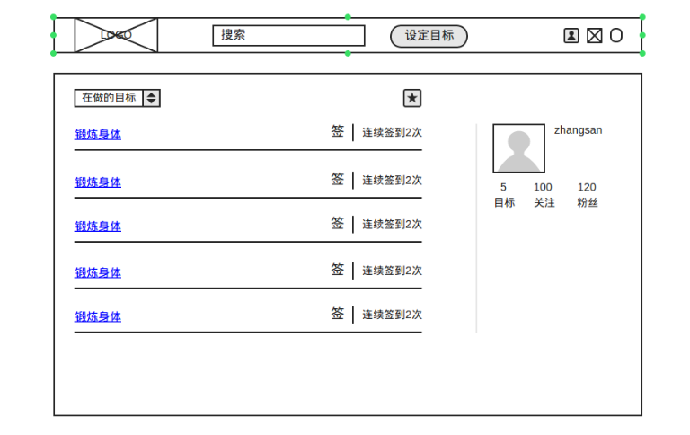
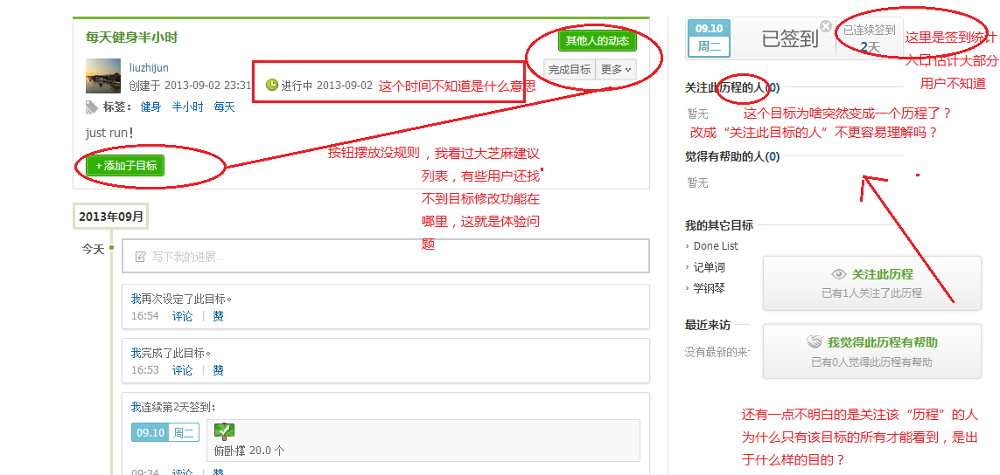
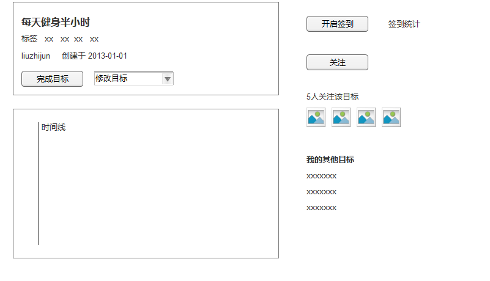
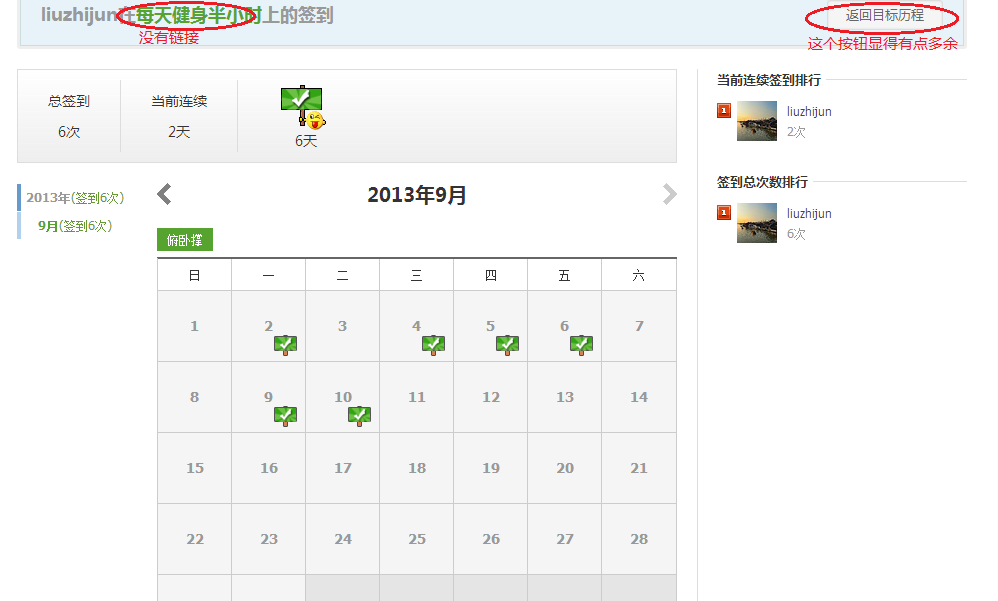
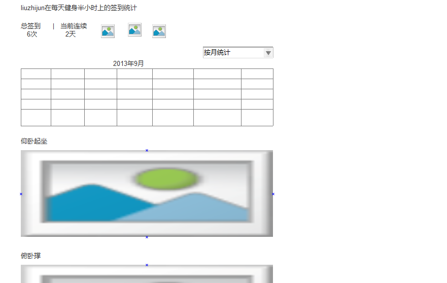

大芝麻
===================
我主要从以下两点对大芝麻提出自己的一些看法  

- 做**减法** ，把核心功能做精。
- 改善用户体验。  

整体思路是通过 **目标** 这个核心功能来孕育一个社区，目前大芝麻的功能非常多，但很多功能的易用性比较差。  
###个人主页

个人主页模块有7个之多，而核心功能主要一个------个人目标管理

1. **最近来访**模块可有可无的功能，这功能虽然提供了，但是并没有真正把握用户的需求，有些用户不希望自己的访问记录留在这里，比如某人女孩暗恋某个男孩，会经常去访问他的主页，但是又不想被发现。QQ空间就做的很人性，它可以删除自己的访问记录。  

2. **好友目标动态** 模块像是一个画蛇添足的功能，因为这里与第三栏的 **最新动态** 重复的  

3. **客户端下载** 模块完全就没考虑过用户的感受，通常一般做法是有一个新页面对该app有个简要介绍，提供了神马样的功能，最重要的是 **二维码**扫描直接跳转至下载页面。就目前这种方式，首先要下载保存在电脑，然后手机要插上数据线才能安装，多麻烦  

4. **消息管理** 个Tab按钮又是一个没必要的链接，因为在页面的右上角”信封“的图标就是和个人消息相关的。到处都是按钮，用户就容易犯晕。做产品的一条原则就是KISS（keep it simple and stupid),写代码也是如此。

5. **目标统计** 这功能看不出其意义在哪里，对用户来没什么作用。与下面tab按钮有部分重叠的功能，只是表现形式不一样，一个用百分比，一个用总数统计。  

6. **个人信息** 这栏在这个页面属于不太重要的信息，可以考虑放在右侧。

7. **目标** 应该是有轻重之分的，就像我们平常做事也有轻重缓急。因此有必要设置优先级，先完成什么，后完成什么。有了优先级，就可以新增一个排序的功能（按时间、优先级等）.对于目标的种类真的有必要设置5种？还值得探讨。如果是只为了满足极少部分用户的需求，完全可以不做，并非每个用户的需求都合理  

下面就是我对该页面的重构

###目标详细页面

1. **签到项**统计功能很难找到，一旦签到功能关闭后，根本无从找到签到统计的链接了  

2. **微薄分享**是在挑战用户的眼力，近视眼很难区分到底有没有选中分享的按钮。这里其实就可以彩色代表分享，灰色代表不分享。  
下面是我对该页面的重构

###公共目标
不知道有没有统计数据，可以看看链接http://www.dazhima.com/goal/xxxx 开头的访问量站整个网站比重多少，个人觉得这个公共目标没多大用途。我更倾向于以**小组**的形式存在。用小组来组建有共同志趣的人在一起讨论  

###统计功能
统计页面给人感觉略显粗糙

每个人的目标并不一样，象这种签到排行放在这里显得并不是那么有意义。个人的观点就是凡是需求不强烈的功能都不应该加进来。  
每个签到项的统计单独一个页面，查看起来繁琐  
下面是我对该页面的重构

最后引用@傅盛一句话和大家共勉：**做产品，一定要有一个符合用户需求的定位，而不是你脑海里的某一种概念**
