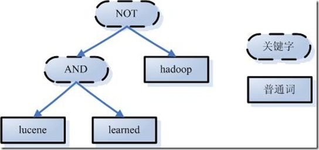
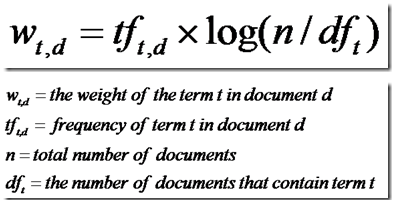
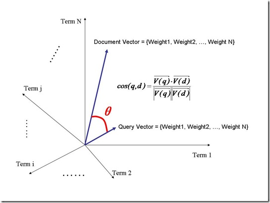

全文检索分为两个过程：1.索引创建（Indexing）2. 搜索索引（Search），由此引入三个问题：  

1. Index：索引里面存放什么？
2. Indexing：如何创建索引？
3. Search：如何对索引进行搜索？

###索引里面存放什么？
**反向索引**：从关键字到文档的映射是文档的关键字映射的反向过程，保存关键字到文档映射的这种信息的索引称为反向索引  

* 左边保存的是字符串序列，成为字典  
* 右边是字符串的文档（Document）链表，称为倒排表（Posting List）

现在想搜索"lucene"，那么索引直接告诉我们，包含有"lucene"的文档有：2，3，10，35，92，而无需在整个文档库中逐个查找。如果是想搜既包含"lucene"又包含"solr"的文档，那么与之对应的两个倒排表去交集即可获得：3、10、35、92。  

###索引创建过程
假设有如下两个原始文档，创建过程大概分为如下步骤：    
文件一：Students should be allowed to go out with their friends, but not allowed to drink beer.  
文件二：My friend Jerry went to school to see his students but found them drunk which is not allowed.  

**一：把原始文档交给分词组件(Tokenizer)**  
分词组件(Tokenizer)会做以下几件事情(这个过程称为：Tokenize)  

1. 将文档分成一个一个单独的单词
2. 去除标点符号
3. 去除停词(stop word)
    * 所谓停词(Stop word)就是一种语言中没有具体含义，因而大多数情况下不会作为搜索的关键词，这样一来创建索引时能减少索引的大小。英语中停词(Stop word)如："the"、"a"、"this"，中文有："的，得"等。不同语种的分词组件(Tokenizer)，都有自己的停词(stop word)集合。经过分词(Tokenizer)后得到的结果称为词元(Token)。上例子中，便得到以下词元(Token)：

            "Students"，"allowed"，"go"，"their"，"friends"，"allowed"，"drink"，"beer"，"My"，"friend"，"Jerry"，"went"，"school"，"see"，"his"，"students"，"found"，"them"，"drunk"，"allowed"

**二：词元(Token)传给语言处理组件(Linguistic Processor)**  
语言处理组件(linguistic processor)主要是对得到的词元(Token)做一些语言相关的处理。对于英语，语言处理组件(Linguistic Processor)一般做以下几点：

1. 变为小写(Lowercase)。
2. 将单词缩减为词根形式，如"cars"到"car"等。这种操作称为：stemming。
3. 将单词转变为词根形式，如"drove"到"drive"等。这种操作称为：lemmatization。

语言处理组件(linguistic processor)处理得到的结果称为**词(Term)**，例子中经过语言处理后得到的词(Term)如下：

    "student"，"allow"，"go"，"their"，"friend"，"allow"，"drink"，"beer"，"my"，"friend"，"jerry"，"go"，"school"，"see"，"his"，"student"，"find"，"them"，"drink"，"allow"。
经过语言处理后，搜索drive时drove也能被搜索出来。**Stemming 和 lemmatization的异同：**  

* 相同之处：
    1. Stemming和lemmatization都要使词汇成为词根形式。  
* 两者的方式不同：  
    1. Stemming采用的是"缩减"的方式："cars"到"car"，"driving"到"drive"。
    2. Lemmatization采用的是"转变"的方式："drove"到"drove"，"driving"到"drive"。
* 两者的算法不同：
    1. Stemming主要是采取某种固定的算法来做这种缩减，如去除"s"，去除"ing"加"e"，将"ational"变为"ate"，将"tional"变为"tion"。
    2. Lemmatization主要是采用事先约定的格式保存某种字典中。比如字典中有"driving"到"drive"，"drove"到"drive"，"am, is, are"到"be"的映射，做转变时，按照字典中约定的方式转换就可以了。
    3. Stemming和lemmatization不是互斥关系，是有交集的，有的词利用这两种方式都能达到相同的转换。

**三：得到的词(Term)传递给索引组件(Indexer)**  
1. 利用得到的词(Term)创建一个字典

        Term	Document ID
        student	    1
        allow	    1
        go	        1
        their	    1
        friend	    1
        allow	    1
        drink	    1
        beer	    1
        my	        2
        friend	    2
        jerry	    2
        go	        2
        school	    2
        see	        2
        his	        2
        student	    2
        find	    2
        them	    2
        drink	    2
        allow	    2
2. 对字典按字母顺序排序：

        Term	Document ID
        allow	    1
        allow	    1
        allow	    2
        beer	    1
        drink	    1
        drink	    2
        find	    2
        friend	    1
        friend	    2
        go	        1
        go	        2
        his	        2
        jerry	    2
        my	        2
        school	    2
        see	        2
        student	    1
        student	    2
        their	    1
        them	    2 
3. 合并相同的词(Term)成为文档倒排(Posting List)链表

* Document Frequency：文档频次，表示多少文档出现过此词(Term)
* Frequency：词频，表示某个文档中该词(Term)出现过几次

对词(Term) "allow"来讲，总共有两篇文档包含此词(Term)，词(Term)后面的文档链表总共有两项，第一项表示包含"allow"的第一篇文档，即1号文档，此文档中，"allow"出现了2次，第二项表示包含"allow"的第二个文档，是2号文档，此文档中，"allow"出现了1次

至此索引创建完成，搜索"drive"时，"driving"，"drove"，"driven"也能够被搜到。因为在索引中，"driving"，"drove"，"driven"都会经过语言处理而变成"drive"，在搜索时，如果您输入"driving"，输入的查询语句同样经过分词组件和语言处理组件处理的步骤，变为查询"drive"，从而可以搜索到想要的文档。

###搜索步骤
搜索"microsoft job"，用户的目的是希望在微软找一份工作，如果搜出来的结果是:"Microsoft does a good job at software industry…"，这就与用户的期望偏离太远了。如何进行合理有效的搜索，搜索出用户最想要得结果呢？搜索主要有如下步骤：  

**一：对查询内容进行词法分析、语法分析、语言处理**  

1. 词法分析：区分查询内容中单词和关键字，比如：english and janpan，"and"就是关键字，"english"和"janpan"是普通单词。 
2. 根据查询语法的语法规则形成一棵树

3. 语言处理，和创建索引时处理方式是一样的。比如：leaned-->lean，driven-->drive

**二：搜索索引，得到符合语法树的文档集合**  
**三：根据查询语句与文档的相关性，对结果进行排序**      

我们把查询语句也看作是一片文档，对文档与文档之间的相关性（relevance）进行打分（scoring），分数高比较越相关，排名就越靠前。当然还可以人工影响打分，比如百度搜索，就不一定完全按照相关性来排名的。  

如何评判文档之间的相关性？一个文档由多个（或者一个）词（Term）组成，比如："solr"， "toturial"，不同的词可能重要性不一样，比如solr就比toturial重要，如果一个文档出现了10次toturial，但只出现了一次solr，而另一文档solr出现了4次，toturial出现一次，那么后者很有可能就是我们想要的搜的结果。这就引申出权重（Term weight）的概念。  

**权重**表示该词在文档中的重要程度，越重要的词当然权重越高，因此在计算文档相关性时影响力就更大。通过词之间的权重得到文档相关性的过程叫做**空间向量模型算法(Vector Space Model)**  

影响一个词在文档中的重要性主要有两个方面：  

* Term Frequencey（tf），Term在此文档中出现的频率，ft越大表示越重要
* Document Frequency（df），表示有多少文档中出现过这个Trem，df越大表示越不重要
物以希为贵，大家都有的东西，自然就不那么贵重了，只有你专有的东西表示这个东西很珍贵，权重的公式：

####空间向量模型

文档中词的权重看作一个向量

    Document = {term1, term2, …… ,term N}
    Document Vector = {weight1, weight2, …… ,weight N}

把欲要查询的语句看作一个简单的文档，也用向量表示：  

    Query = {term1, term 2, …… , term N}
    Query Vector = {weight1, weight2, …… , weight N}

把搜索出的文档向量及查询向量放入N维度的空间中，每个词表示一维：  

夹角越小，表示越相似，相关性越大

