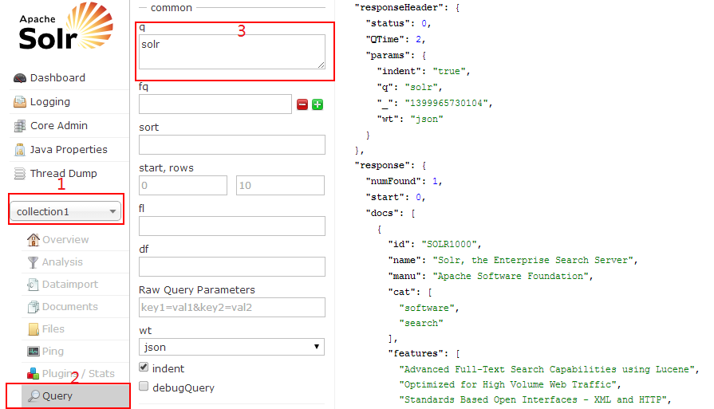

如果你和我一样是Solr新手，那么就和我一起来入门吧！本教程以solr4.8作为测试环境，jdk版本需要1.7及以上版本。  
####准备
下载解压缩solr，在example目录有start.jar文件，启动：  
    
    java -jar start.jar
浏览器访问：[http://localhost:8983/solr/](http://localhost:8983/solr/)，你看到的就是solr的管理界面

####索引数据
服务启动后，目前你看到的界面没有任何数据，你可以通过POSTing命令向Solr中添加（更新）文档，删除文档，在exampledocs目录包含一些示例文件，运行命令：
    
    java -jar post.jar solr.xml monitor.xml
上面的命令是向solr添加了两份文档，打开这两个文件看看里面是什么内容，solr.xml里面的内容是：

    <add>
    <doc>
      <field name="id">SOLR1000</field>
      <field name="name">Solr, the Enterprise Search Server</field>
      <field name="manu">Apache Software Foundation</field>
      <field name="cat">software</field>
      <field name="cat">search</field>
      <field name="features">Advanced Full-Text Search Capabilities using Lucene</field>
      <field name="features">Optimized for High Volume Web Traffic</field>
      <field name="features">Standards Based Open Interfaces - XML and HTTP</field>
      <field name="features">Comprehensive HTML Administration Interfaces</field>
      <field name="features">Scalability - Efficient Replication to other Solr Search Servers</field>
      <field name="features">Flexible and Adaptable with XML configuration and Schema</field>
      <field name="features">Good unicode support: h&#xE9;llo (hello with an accent over the e)</field>
      <field name="price">0</field>
      <field name="popularity">10</field>
      <field name="inStock">true</field>
      <field name="incubationdate_dt">2006-01-17T00:00:00.000Z</field>
    </doc>
    </add>

表示向索引中添加一个文档，文档就是用来搜索的数据源，现在就可以通过管理界面搜索关键字"solr"，具体步骤是：

点击页面下的`Execute Query`按钮后右侧就会显示查询结果，这个结果就是刚才导入进去的solr.xml的json格式的展示结果。solr支持丰富的查询语法，比如：现在想搜索字段`name`里面的关键字"Search"就可以用语法`name:search`，当然如果你搜索`name:xxx`就没有返回结果了，因为文档中没有这样的内容。    

####数据导入
导入数据到Solr的方式也是多种多样的：  

* 可以使用DIH(DataImportHandler)从数据库导入数据
* 支持CSV文件导入，因此Excel数据也能轻松导入
* 支持JSON格式文档
* 二进制文档比如：Word、PDF
* 还能以编程的方式来自定义导入

####更新数据
如果同一份文档solr.xml重复导入会出现什么情况呢？实际上solr会根据文档的字段`id`来唯一标识文档，如果导入的文档的`id`已经存在solr中，那么这份文档就被最新导入的同`id`的文档自动替换。你可以自己尝试试验一下，观察替换前后管理界面的几个参数：`Num Docs`，`Max Doc`，`Deleted Docs`的变化。  

* numDocs：当前系统中的文档数量，它有可能大于xml文件个数，因为一个xml文件可能有多个`<doc>`标签。
* maxDoc：maxDoc有可能比numDocs的值要大，比如重复post同一份文件后，maxDoc值就增大了。
* deletedDocs：重复post的文件会替换掉老的文档，同时deltedDocs的值也会加1，不过这只是逻辑上的删除，并没有真正从索引中移除掉

####删除数据
通过id删除指定的文档，或者通过一个查询来删除匹配的文档

    java -Ddata=args -jar post.jar "<delete><id>SOLR1000</id></delete>"
    java -Ddata=args -jar post.jar "<delete><query>name:DDR</query></delete>"

此时`solr.xml`文档从索引中删除了，再次搜"solr"时不再返回结果。当然solr也有数据库中的事务，执行删除命令的时候事务自动提交了，文档就会立即从索引中删除。你也可以把commit设置为false，手动提交事务。  

    java -Ddata=args  -Dcommit=false -jar post.jar "<delete><id>3007WFP</id></delete>"
执行完上面的命令时文档并没有真正删除，还是可以继续搜索相关结果，最后可以通过命令：  

    java -jar post.jar -
强制提交事务，文档就彻底删除了。现在把刚刚删除的文件重新导入Solr中来，继续我们的学习。   

删除所有数据：  
    
    http://localhost:8983/solr/collection2/update?stream.body=<delete><query>*:*</query></delete>&commit=true

####查询数据
查询数据都是通过HTTP的GET请求获取的，搜索关键字用参数`q`指定，另外还可以指定很多可选的参数来控制信息的返回，例如：用`fl`指定返回的字段，比如`f1=name`，那么返回的数据就只包括name字段的内容

    http://localhost:8983/solr/collection1/select?q=solr&fl=name&wt=json&indent=true

* 排序

    Solr提供排序的功能，通过参数`sort`来指定，它支持正序、倒序，或者多个字段排序
    * q=video&sort=price desc
    * q=video&sort=price asc
    * q=video&sort=inStock asc, price desc
    默认条件下，Solr根据`socre` 倒序排列，socre是一条搜索记录根据相关度计算出来的一个分数。
* 高亮
    
    网页搜索中，为了突出搜索结果，可能会对匹配的关键字高亮出来，Solr提供了很好的支持，只要指定参数：
    * hl=true  #开启高亮功能
    * hl.fl=name #指定需要高亮的字段 

            http://localhost:8983/solr/collection1/select?q=Search&wt=json&indent=true&hl=true&hl.fl=features

        返回的内容中包含：

                "highlighting":{
                       "SOLR1000":{
                           "features":["Advanced Full-Text <em>Search</em> Capabilities using Lucene"]
                       }
                }

####文本分析
文本字段通过把文本分割成单词以及运用各种转换方法（如：小写转换、复数移除、词干提取）后被索引，schema.xml文件中定义了字段在索引中，这些字段将作用于其中.  
默认情况下搜索"power-shot"是不能匹配"powershot"的，通过修改schema.xml文件(solr/example/solr/collection1/conf目录)，把features和text字段替换成"text_en_splitting"类型，就能索引到了。  

    <field name="features" type="text_en_splitting" indexed="true" stored="true" multiValued="true"/>
    ...
    <field name="text" type="text_en_splitting" indexed="true" stored="false" multiValued="true"/>
修改完后重启solr，然后重新导入文档  

    java -jar post.jar *.xml

现在就可以匹配了

* power-shot--->Powershot
* features:recharing--->Rechargeable 
* 1 gigabyte  --> 1G

####总结
作为入门文章，本文没有引入太多概念。安装到部署，文档更新，对solr有了初步感性的认识，接下来逐步深入学习。  

