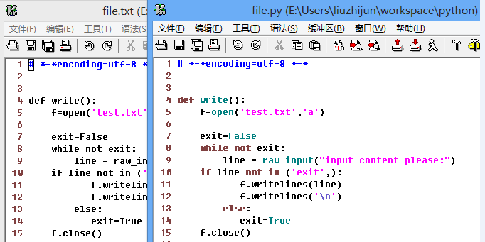

 每日一Vim（23）filetype---- 文件类型检测
 ----------------------
 当你用Vim打开某种编程语言的文件时，你会看到关键字，函数名等等都会高亮，下图是两个内容一样，名称不一样的文件，一个是txt，一个是py，明显能看出txt文件显示并不是那么友好。这就和`filetype`有关系啦。  

执行`:filetype`可以查看Vim的文件类型检测功能是否已打开，默认你会看到：`detection:ON plugin:OFF indent:OFF`。下面详细介绍这三个参数的具体含义。

detection：默认情况vim会对文件自动检测文件类型，也就是你看到的'detection:ON'，同样你可以手动关闭`:filetype off`。 因此我们看到dection 也是ON，所以Vim会很友好的显示文本， 可以用`:set filetype`查看当前文件是什么类型了。 类似的如果如上图中file.txt文件的filetype设置为python那么就和普通的python文件一样的显示效果了：`set filetype=python`。  

另一种方式就是在文件内容中指定，Vim会从文件的头几行自动扫描文件是否有声明文件的类型的代码，如在文件的行首加入`# vim: filetype=python`，Java文件变通的做法`/* vim: filetype=java */`，总之就是把这行当作注释，以致于不影响文件的编译，这样Vim不通过文件名也能检测出文件是什么类型了。

plugin：如果plugin状态时ON，那么就会在Vim的运行时环境目录下加载该类型相关的插件。比如为了让Vim更好的支持Python编程，你就需要下载一些Python相关的插件，此时就必须设置plugin为ON插件才会生效，具体设置方法就是`:filetype plugin on`

indent：不同类型文件有不同的方式，比如Python就要求使用4个空格作为缩进，而c使用两个tab作为缩进，那么indent就可以为不同文件类型选择合适的缩进方式了。你可以在Vim的安装目录的indent目录下看到定义了很多缩进相关的脚本。具体设置方法：`filetype plugin on`。

以上三个参数，可以写成一行`filetype plugin indent on`设置在_vimrc文件中。

转载请注明出处，谢谢合作！作者---[zhijun](http://weibo.com/527355345) 
